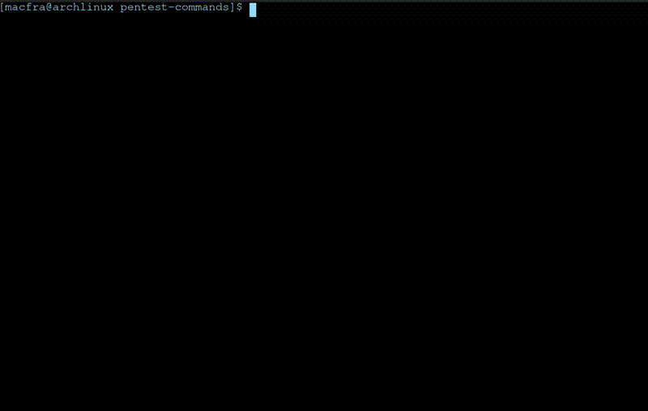

## pentest-commands ##

pentest-commands is simply a quick way to set up common and useful commands
for quick access in an easy and a quick way. Sometimes you might need to reinstall or install a new system
or simply set up new VMs. This is where *pentest-commands* comes in to play!

### clone ###
```
git clone https://github.com/macfra98/pentesting-commands.git
```

### installation ###
Simply use sh to install. It will automatically detect your $SHELL and update your $SHELLrc file accordingly (works only if you have $SHELLrc file in your "/home/user" directory).
```
sh install.sh
```
### how to use ###
It's really easy to use, after the installation simply enter any of the available aliases.
```
$ common 

> ... output ...
```


If you want some guidance.
```
$ commands
usage: Commands Guide [-h] [-a] [-w] [-l] [-wb] [-t]

Guides the user of which alias to specify, why, and when.

options:
  -h, --help     show this help message and exit
  -a, --all      The flag specifies aliases used by all types
  -w, --windows  The flag specifies windows related aliases
  -l, --linux    The flag specifies linux related aliases
  -wb, --webapp  The flag specifies webapp related aliases
  -t, --tools    The flag specifies tools related aliases

$ commands -l
TYPE         ALIAS        DESCRIPTION
####################################################################################################
linux      : linhold    : contains useful commands after the initial access.
linux      : ttys       : contains tty shells
linux      : linesc     : contains different privilege escalation methods/paths
linux      : kernsploit : contains CVE:s for kernelexploitation
.
.
####################################################################################################
```

### available aliases ###
*[!] the commands are frequently being updated!* 

1. *ALL*
    - [x] common --> "`common` &nbsp;&nbsp;common commands frequently used in pentest/CTF"
    - [x] revshells --> "`revshells` &nbsp;&nbsp;reverse shells"
2. *LINUX*
    - [x] linhold --> "`linhold` &nbsp;&nbsp;after the initial foothold"
    - [x] ttys --> "`ttys` &nbsp;&nbsp;tty shells"
    - [ ] breakout --> "`breakout`&nbsp;&nbsp;break out of a restricted shell
    - [x] linesc --> "`linesc`&nbsp;&nbsp;privilege escalation paths   
    - [x] kernsploit --> "`kernsploit` &nbsp;&nbsp;CVE:s for kernelexploitation"
    - [x] lintran --> "`lintran`&nbsp;&nbsp;transfering files
    - [x] lintun --> "`lintun`&nbsp;&nbsp;proxy/tunneling
3. *WINDOWS*
    - [ ] powercom --> "`powercom` &nbsp;&nbsp;C.. 
    - [ ] winhold --> "`winhold` contains &nbsp;&nbsp;C.. 
    - [ ] winesc --> "`winesc` contains &nbsp;&nbsp;C.. 
    - [x] wintran --> "`wintran` &nbsp;&nbsp;transfering files
4. *WEBAPP*
    - [ ] sqlicom --> "`sqlicom` contains &nbsp;&nbsp;C.. 
    - [x] ficom --> "`ficom` &nbsp;&nbsp; LFI/RFI (also wrappers) 
    - [x] fuzzcom --> "`fuzzcom` &nbsp;&nbsp; fuzzing commands (wfuzz,ffuf,gobuster,etc..) 
4. *TOOLS*
    - [ ] cmecom --> "`cmecom`&nbsp;&nbsp;common crackmapexec commands 
    - [ ] mimicom --> "`mimicom`  contains &nbsp;&nbsp;C.. 
    - [ ] mapcom --> "`mapcom`  contains &nbsp;&nbsp;C.. 
    - [x] brutecom --> "`brutecom`&nbsp;&nbsp;brute force tools
4. *SERVICES*
    - [x] mailcom --> "`mailcom`&nbsp;&nbsp;mail services (smtp/pop3)
